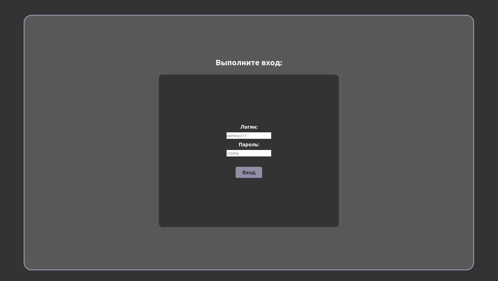
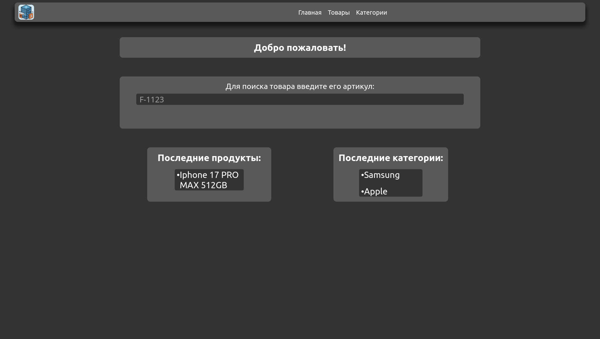
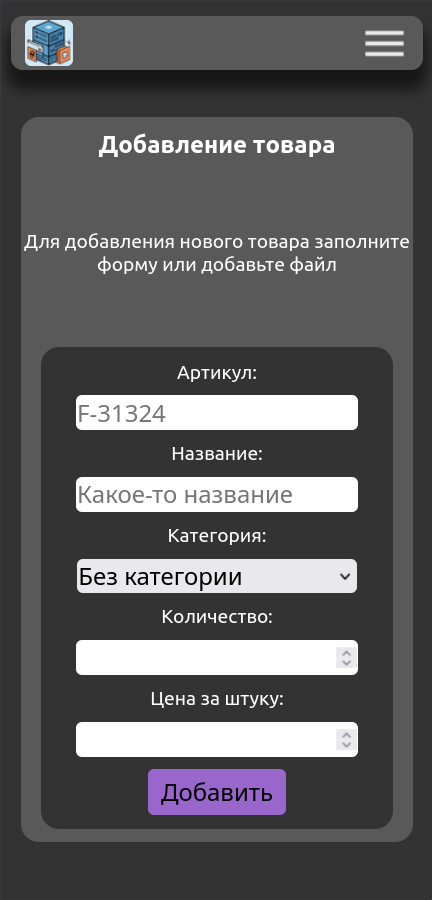
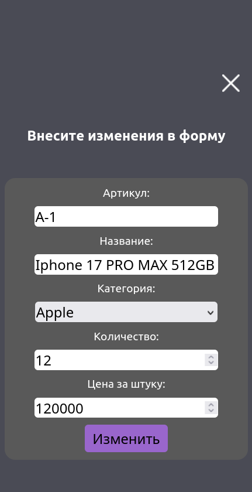

## About:
This is a web interface designed for managing warehouse inventory of goods. The project supports the following features:

    1. CRUD operations for goods

    2. CRUD operations for categories

    3. Search for goods by SKU

    4. Viewing all available goods and categories

The backend is written in the Rust programming language, using key dependencies such as:

    1. Axum

    2. tower

    3. tower-sessions

    4. serde

    5. serde_json

    6. sqlx

    7. argon2

    8. tokio

    9. thiserror

The frontend is built using standard technologies: HTML, CSS, JS.
Next, I would like to provide some screenshots of the interface:






## How to use?

To use this web interface, you need to understand that your host machine must have Rust version 1.94.0 installed, along with the Cargo compiler version 1.94.0. Docker with Docker Compose is also required, as the project assumes storing the database in a container.

Before usage (running docker-compose.yml and compiling the project), create a .env file in the project root (on the same level as docker-compose.yml) and add the following data:

```
POSTGRES_PASSWORD=your_password
POSTGRES_USER=your_login
POSTGRES_DB=your_database_name
```

This is necessary for Docker to create the database with the specified credentials.

Next, locate the database connection pool creation in `/src/includes/start_web.rs` and specify the exact database connection details.

After this, run docker compose up -d with the standard command to pull and build the database image. Then, compile the project using `cargo build --release`. The executable file will be located at `target/release/project_name`.
You also need to add authentication data to the migration files before compiling the project. Currently, the same data with the login - Admin and password 1111 is installed there in a cached format. The Argon2 crate was used for hashing, but perhaps soon I will make a CLI utility for hashing data.
